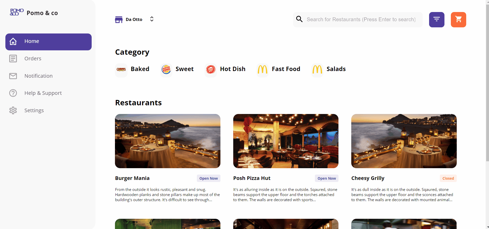

# pomo-restaurant 🏢

## Get Started

All the code goes inside 'src' folder.   

The Project mainly works on two __API__ :
1. has all restaurants
2. contains details of above restaurants

The App includes three defined Routes & redirects unknown URLs to Homepage.js    
It shows Restaurant(s) based on filters.  
Filters are applied on "All Restaurants" data.  
All filters are done in the code & not passed as *parameter* to API.

### Types of Filters 

1. __Category__ : filters restaurants on single category.
2. __Input__ : filters on the basis of Restaurant Name entered by the user.
3. __Cuisine__ : user can select multiple cuisines and <br> data is shown if selected cuisine is matched with cuisines served by the Restaurant. <br> (Note: Make sure to deselect default option i.e "ALL")

## Installation

This command with clone the repo and install all dependencies required to run the application.

```bash
git clone https://github.com/aggarwal-muskaan/restaurant.git
cd [foldername]
npm install
```


## Demo


### 🙌 Build with React.js 💕
